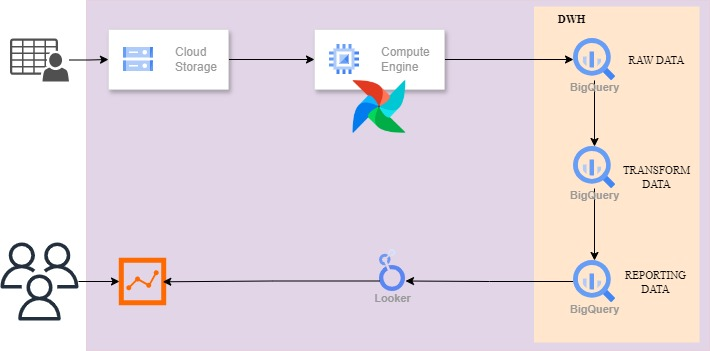
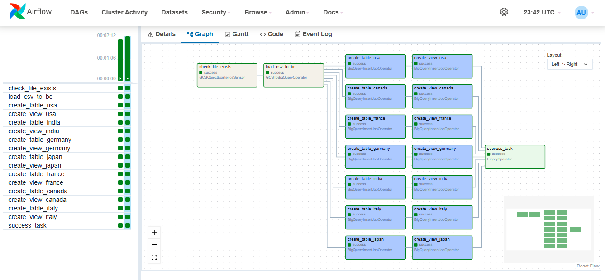
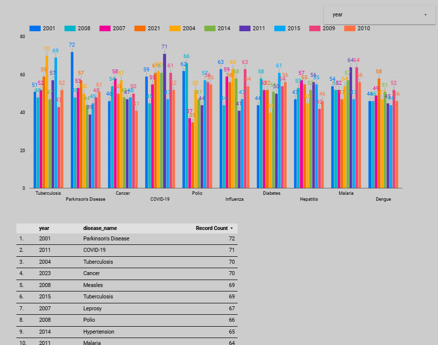

# ELT Data Pipeline with GCP and Airflow

This project demonstrates how to build an **ELT (Extract, Load, Transform)** data pipeline to process **1 million records** using **Google Cloud Platform (GCP)** and **Apache Airflow**. The pipeline extracts data from Google Cloud Storage (GCS), loads it into BigQuery, and transforms it to create country-specific tables and views for analysis.

---

## Features

- Extract data from GCS in CSV format.
- Load raw data into a staging table in BigQuery.
- Transform data into country-specific tables and reporting views.
- Use Apache Airflow to orchestrate the pipeline.
- Generate clean and structured datasets for analysis.

---

## Architecture

### Workflow

1. **Extract**: Check for file existence in GCS.
2. **Load**: Load raw CSV data into a BigQuery staging table.
3. **Transform**:
   - Create country-specific tables in the transform layer.
   - Generate reporting views for each country with filtered insights.

### Data Layers

1. **Raw Layer**: Raw data from the CSV file.
2. **Transform Layer**: Cleaned and transformed tables.
3. **Reporting Layer**: Views optimized for analysis and reporting.

---

## Requirements

### Tools and Services

- **Google Cloud Platform (GCP)**:
  - Google Compute Engine ( for Airflow )
  - BigQuery
  - Cloud Storage
- **Apache Airflow**:
  - Airflow with Google Cloud providers

---

## Setup Instructions

### Prerequisites

1. A Google Cloud project with:
   - BigQuery and Cloud Storage enabled.
   - Service account with required permissions.
2. Apache Airflow installed.
3. Airflow Installation on VM

## End Result

### Airflow Pipeline

### Looker Studio Report

